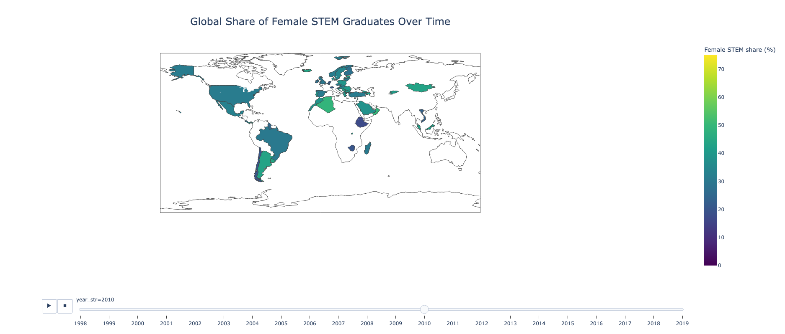
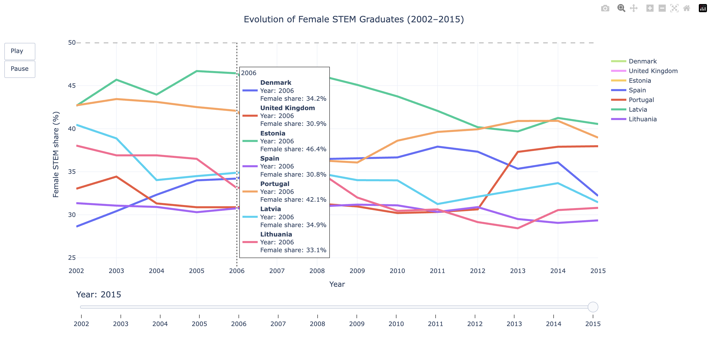

# Women in STEM: A Data Storytelling Project with Animated Visualizations

This project explores how the share of women graduating in STEM fields has evolved across countries over time.

The analysis combines interactive visualizations and data storytelling to highlight long-term trends, differences between countries, and the effect of incomplete data coverage on cross-country comparisons.

---

## Interactive visualizations
Explore the interactive animations below to see how female participation in STEM evolves over time across countries. 

[Open the interactive map animation](https://val-lilu.github.io/women-in-STEM-data-storytelling/outputs/stem_map_animation.html)

[Open the interactive line animation](https://val-lilu.github.io/women-in-STEM-data-storytelling/outputs/stem_line_animation.html)

## Project goal

The objective of this project is to examine patterns in female representation among STEM graduates and to compare how these patterns differ across countries.

The notebook focuses on three main questions:

- How has the share of female STEM graduates changed globally over time?
- Which countries show consistently higher or lower representation?
- How does missing data affect the interpretation of animated and comparative visualizations?

---

## Dataset

The project uses a dataset containing the **female share of graduates from Science, Technology, Engineering and Mathematics (STEM) programmes, tertiary (%)** by country and year.

In this notebook, the variable `female_stem_share` represents:

> the percentage of women among all STEM graduates in a given country and year.

---

## Tools used

- Python  
- Pandas  
- Plotly  
- Jupyter Notebook  

---

[Open the interactive map animation](stem_map_animation.html)

### Focused animated line chart

[Open the interactive line animation](stem_line_animation.html)

---

## Analysis and key insights

### Data limitations
- Not all countries have data for every year.
- As a result, some countries appear and disappear in the animated map.
- This makes direct comparisons across the full dataset unreliable.

### Adjusted analysis approach
To address this issue:
- The analysis was restricted to a common time window (2002–2015).
- Only countries with complete data over this period were selected.
- A smaller subset of countries was used for clearer visualization and comparison.

### Country-level insights
- Estonia and Latvia consistently show higher shares of female STEM graduates.
- Denmark and Spain remain at comparatively lower levels throughout most of the period.
- Portugal shows a noticeable upward trend toward the end of the time window.
- The United Kingdom and Lithuania exhibit relatively stable intermediate patterns.

### Key takeaway
Female representation in STEM remains below gender parity across the observed countries and time period. While some countries show gradual improvement, progress is uneven and parity has not yet been achieved.

Accounting for missing data is essential, as it significantly affects how trends are interpreted in cross-country comparisons.

---

## How to run the project

1. Clone the repository  
2. Open the notebook in Jupyter  
3. Ensure the dataset file is in the correct path  
4. Run the notebook from top to bottom  

---

## Data source

The dataset used in this project is sourced from Our World in Data:

- Female share of graduates from Science, Technology, Engineering and Mathematics (STEM) programmes (%)

Source: https://ourworldindata.org/

---

## Author

Valeriia Lutoshkyna
